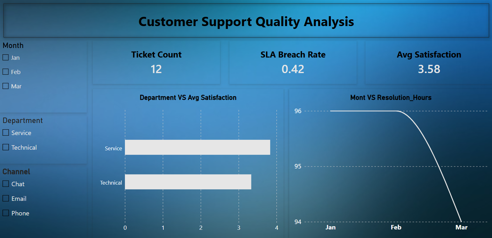

# 🎧 Customer Support Quality Analysis

> An end-to-end analytics project that measures **how fast** and **how well** a customer support organisation resolves tickets, built with **SQL, Python, Excel and Power BI** on the same dataset.


---

## 📑 Table of Contents

1. [Project Overview](#-project-overview)
2. [Business Questions](#-business-questions)
3. [Dataset](#-dataset)
4. [Tech Stack](#-tech-stack)
5. [Repository Structure](#-repository-structure)
6. [Methodology](#-methodology)
   - [SQL](#1-sql--exam_2sql)
   - [Python](#2-python--customer_support_quality_analysisipynb)
   - [Excel](#3-excel--project_exam_2_version_2_xlsx)
   - [Power BI](#4-power-bi--customer_support_quality_analysispbix)
7. [Key Findings](#-key-findings)
8. [Recommendations](#-recommendations)
9. [How to Run](#-how-to-run)
10. [Known Issues & Lessons Learned](#-known-issues--lessons-learned)
11. [Future Improvements](#-future-improvements)
12. [Author](#-author)

---

## 🎯 Project Overview

A support team is only as good as its speed and its customers' happiness. This project analyses **12 support tickets** raised across **3 months (Jan–Mar)**, handled by **4 teams** in **2 departments**, through **3 channels** (Email, Chat, Phone).

The same problem is solved with four tools so the results can be **cross-validated**:

| Tool | Role in the project |
|------|---------------------|
| **MySQL** | Build the database, load data, answer business questions with queries |
| **Python** | Clean, merge, engineer the SLA breach flag, summarise and visualise |
| **Excel** | Remove duplicates, lookup departments, build a pivot table + chart |
| **Power BI** | Interactive one-page dashboard with KPIs and slicers |

The central business rule used everywhere:

> **SLA breach = a ticket whose `resolution_hours` is greater than 24.**

---

## ❓ Business Questions

1. Which **department** takes the longest to resolve tickets on average?
2. What percentage of tickets **breach the 24-hour SLA**, overall and per department?
3. How does **resolution time trend month by month**?
4. How does **customer satisfaction** differ across departments, teams and channels?
5. Which individual tickets are the **slowest** and need attention first?

---

## 🗂 Dataset

The data lives in two related tables (also available as `tickets.csv` / `teams.csv` in the notebook and as sheets in the Excel file).

### `tickets` — 12 rows (fact table)

| Column | Type | Description |
|--------|------|-------------|
| `ticket_id` | INT (PK) | Unique ticket identifier |
| `month` | VARCHAR | Month raised (Jan, Feb, Mar) |
| `team_id` | VARCHAR (FK → teams) | Team that handled the ticket |
| `channel` | VARCHAR | Email, Chat or Phone |
| `resolution_hours` | INT | Hours taken to resolve |
| `satisfaction` | INT | Customer rating, 1 (worst) – 5 (best) |

### `teams` — 4 rows (dimension table)

| `team_id` | `team` | `department` |
|-----------|--------|--------------|
| T1 | AccountCare | Service |
| T2 | BillingHelp | Service |
| T3 | AppSupport | Technical |
| T4 | DeviceHelp | Technical |

**Relationship:** `tickets.team_id` → `teams.team_id` (many-to-one).

> 📝 The raw Excel sheet (`orignal_tickets`) intentionally contains **one duplicate row** (ticket 12 appears twice). It is removed during cleaning so every tool ends up with exactly **12 unique tickets**.

---

## 🛠 Tech Stack

- **MySQL** – schema design, primary/foreign keys, joins, aggregation, `HAVING`
- **Python 3** – `pandas`, `numpy`, `matplotlib`, `seaborn`
- **Microsoft Excel** – Remove Duplicates, `XLOOKUP`, array formulas, PivotTable, PivotChart
- **Power BI Desktop** – data model, DAX measures, cards, bar/line charts, slicers
- **Jupyter Notebook** – reproducible analysis

---

## 📁 Repository Structure

```
customer-support-quality-analysis/
│
├── README.md
├── sql/
│   └── exam_2.sql                              # Schema, data load and queries
├── notebooks/
│   └── Customer_Support_Quality_Analysis.ipynb # Python analysis
├── excel/
│   └── project_exam_2__version_2_.xlsx         # Cleaning, pivot table, chart
├── powerbi/
│   └── Customer_Support_Quality_Analysis.pbix  # Interactive dashboard
├── data/
│   ├── tickets.csv                             # (export from the SQL/Excel data)
│   └── teams.csv
├── outputs/
│   ├── clean_data.csv                          # Generated by the notebook
│   └── python_summary.csv                      # Generated by the notebook
└── images/
    ├── python_monthly_avg_resolution.png
    ├── powerbi_dashboard.png                   # (add a screenshot)
    └── excel_pivot_chart.png                   # (add a screenshot)
```

> 💡 Tip: rename `project_exam_2__version_2_.xlsx` to something cleaner such as `support_analysis.xlsx` before pushing.

---

## 🔬 Methodology

### 1. SQL — `exam_2.sql`

**Setup**
- Creates the `exam_2` database, the `teams` and `tickets` tables, with a **primary key** on each and a **foreign key** from `tickets.team_id` to `teams.team_id`.
- Inserts 4 teams and 12 tickets.

**Queries**

| ID | Purpose | Logic |
|----|---------|-------|
| **S2a** | Average resolution time per department | `JOIN` tickets → teams, `GROUP BY department`, `AVG(resolution_hours)`, sorted descending |
| **S2b** | Tickets resolved faster than 24 hours on average | `GROUP BY ticket_id HAVING AVG(resolution_hours) < 24` |
| **S2c** | Top 2 slowest tickets above 24 hours | `GROUP BY ticket_id HAVING SUM(resolution_hours) > 24 ORDER BY ... DESC LIMIT 2` |

```sql
-- S2a: average resolution hours by department
SELECT tm.department, AVG(t.resolution_hours) AS avg_resolution_hours
FROM tickets t
JOIN teams tm ON t.team_id = tm.team_id
GROUP BY tm.department
ORDER BY avg_resolution_hours DESC;
```

**Results**

| S2a — department | avg_resolution_hours |
|------------------|---------------------:|
| Technical | 28.33 |
| Service | 19.33 |

- **S2b** returns tickets **1, 4, 5, 7, 9, 10** (all resolved in under 24 hours).
- **S2c** returns ticket **8 (40 h)** and ticket **3 (36 h)**.

> ℹ️ Because `ticket_id` is unique, `AVG`/`SUM` per ticket equals the ticket's own `resolution_hours`, so S2b and S2c act as row filters. For team-level or department-level insight, group by `team_id` or `department` instead.

---

### 2. Python — `Customer_Support_Quality_Analysis.ipynb`

The notebook follows three clearly labelled phases.

**Phase 1 — Load, clean, merge**
- Reads `tickets.csv` and `teams.csv`; checks nulls with `isnull().sum()` (**no missing values**).
- `drop_duplicates()` removes repeated rows.
- `LEFT JOIN` (`tickets.merge(teams, on="team_id", how="left")`).
- **Data-quality checks:** `assert len(merged_df) == 12` and verifies **0 unmatched `team_id`s**.

**Phase 2 (P2) — Derived field & department analysis**
```python
merged_df["breach_flag"] = (merged_df["resolution_hours"] > 24).astype(int)

department_summary = (
    merged_df.groupby("department").agg(
        total_tickets=("ticket_id", "count"),
        breached_tickets=("breach_flag", "sum"),
        sla_breach_rate=("breach_flag", "mean"),
    ).reset_index()
)
department_summary["sla_breach_rate"] = (department_summary["sla_breach_rate"] * 100).round(2)
```

| department | total_tickets | breached_tickets | sla_breach_rate (%) |
|------------|--------------:|-----------------:|--------------------:|
| Service | 6 | 2 | 33.33 |
| Technical | 6 | 3 | 50.00 |

**Phase 3 (P3) — Chart & exports**
- Seaborn bar plot of **monthly average resolution time**.
- Exports `outputs/clean_data.csv` and `outputs/python_summary.csv`.


---

### 3. Excel — `project_exam_2__version_2_.xlsx`

| Sheet | What it contains |
|-------|------------------|
| `orignal_tickets` | Raw data (13 rows including 1 duplicate) |
| `teams` | Team → department lookup table |
| `task` | Cleaned 12 rows + `department` via **`XLOOKUP`** + `breach_flag` |
| `Pivot&chart` | PivotTable *"department wise average hour"* + clustered column chart |

**Pivot result — average resolution hours (Department × Month)**

| Department | Jan | Feb | Mar | Grand Total |
|------------|----:|----:|----:|------------:|
| Service | 20 | 19 | 19 | 19.33 |
| Technical | 28 | 29 | 28 | 28.33 |
| **Grand Total** | **24** | **24** | **23.5** | **23.83** |

Chart: *Department vs Resolution Hours* (columns by month).

```excel
=XLOOKUP(C2, teams!$A$2:$A$5, teams!$C$2:$C$5)
```

---

### 4. Power BI — `Customer_Support_Quality_Analysis.pbix`

A single-page dashboard (1550 × 750) titled **"Customer Support Quality Analysis"**.

| Element | Type | Purpose |
|---------|------|---------|
| Ticket Count | KPI card | Total tickets in the current filter |
| SLA Breach Rate | KPI card | Share of tickets over 24 hours |
| Avg Satisfaction | KPI card | Mean customer rating |
| Department vs Avg Satisfaction | Bar chart | Compare satisfaction between departments |
| Month vs Resolution Hours | Line chart | Resolution time trend across months |
| Month / Department / Channel | Slicers | Interactive filtering of every visual |

**Data model:** `orignal_tickets` (fact) related to `teams` (dimension) on `team_id`, with three DAX measures: `Ticket Count`, `SLA Breach Rate`, `Avg Satisfaction`.



---

## 📊 Key Findings

All numbers below match across SQL, Python and Excel.

| Metric | Value |
|--------|------:|
| Total tickets | **12** |
| Average resolution time | **23.83 hours** |
| Average satisfaction | **3.58 / 5** |
| SLA breaches (> 24 h) | **5 of 12 (41.7%)** |

**By department**

| Department | Avg resolution (h) | Avg satisfaction | SLA breach rate |
|------------|-------------------:|-----------------:|----------------:|
| Service | 19.33 | 3.83 | 33.3% |
| Technical | 28.33 | 3.33 | 50.0% |

**By team**

| Team | Avg resolution (h) | Avg satisfaction | Breaches |
|------|-------------------:|-----------------:|---------:|
| AccountCare | 12.00 | 4.33 | 0 |
| DeviceHelp | 28.00 | 3.67 | 1 |
| BillingHelp | 26.67 | 3.33 | 2 |
| AppSupport | 28.67 | 3.00 | 2 |

**By channel**

| Channel | Avg resolution (h) | Avg satisfaction | Breaches |
|---------|-------------------:|-----------------:|---------:|
| Email | 18.0 | 4.00 | 0 |
| Phone | 26.5 | 3.50 | 2 |
| Chat | 27.0 | 3.25 | 3 |

**Insights**

1. 🔴 **Technical is the bottleneck** — about 9 hours slower than Service, with a 50% breach rate.
2. 🟢 **AccountCare is the benchmark** — fastest (12 h), happiest customers (4.33) and zero breaches.
3. 📉 **Speed drives satisfaction** — resolution time and satisfaction show a strong negative correlation (**r ≈ −0.85**): slower tickets get lower ratings.
4. 📬 **Email outperforms Chat and Phone** — no breaches and the highest satisfaction.
5. ➡️ **Monthly trend is flat** — 24 h in Jan, 24 h in Feb, 23.5 h in Mar; there is no meaningful improvement over the quarter.
6. 🐢 **Slowest tickets** — #8 (40 h, DeviceHelp/Chat) and #3 (36 h, AppSupport/Phone).

> ⚠️ With only 12 tickets, findings are **indicative, not statistically conclusive**. The workflow is built to scale to real ticket volumes.

---

## 💡 Recommendations

- **Prioritise Technical teams** (AppSupport, DeviceHelp): add staffing, runbooks or escalation paths to cut resolution time.
- **Replicate AccountCare's playbook** across other teams (templates, triage, ownership).
- **Review Chat and Phone workflows** — most breaches originate there; consider routing simple issues to Email-style async handling.
- **Set early-warning alerts** for tickets approaching the 24-hour mark.
- **Track the trend weekly**, not monthly, to see whether changes actually move the needle.

---

## 🚀 How to Run

### SQL
```bash
mysql -u <user> -p < sql/exam_2.sql
```
Or open `exam_2.sql` in MySQL Workbench and run all statements.

### Python
```bash
pip install pandas numpy matplotlib seaborn jupyter
jupyter notebook notebooks/Customer_Support_Quality_Analysis.ipynb
```
> Update the two `pd.read_csv(...)` paths at the top of the notebook — they currently point to a local Windows folder. Use relative paths such as `data/tickets.csv` instead.

### Excel
Open the `.xlsx` file in Excel 2021 / Microsoft 365 (required for `XLOOKUP`).

### Power BI
Open the `.pbix` file in **Power BI Desktop**. If prompted, refresh the data or re-point the source to the files in `data/`.

---

## 🐞 Known Issues & Lessons Learned

Being transparent about limitations makes the project stronger:

1. **Excel `breach_flag` formula is shifted by one row.**
   The array formula `=IF(E1:E13>24,1,0)` placed in `H2:H14` compares each ticket against the *previous* row (and the text header in row 1 evaluates as "greater than 24"). The corrected version is:
   ```excel
   =IF(E2>24,1,0)
   ```
   filled down for rows 2–13. The correct breach tickets are **#2, #3, #6, #8 and #11** (5 total), which matches the Python and SQL results.
2. **Hard-coded local file paths** in the Python notebook reduce portability.
3. **Power BI line chart** uses *Sum* of resolution hours; because every month has 4 tickets this looks fine, but **Average** is the more robust aggregation. The chart title also has a typo (*"Mont VS Resolution_Hours"* → *"Month vs Avg Resolution Hours"*).
4. **SQL S2b / S2c** group by the unique `ticket_id`, so they behave like simple filters. Grouping by `team` or `department` would give richer answers.
5. The sheet name `orignal_tickets` is misspelled (kept as-is to avoid breaking the Power BI model).

---

## 🔭 Future Improvements

- Add **SLA breach rate by team and channel** to the Power BI dashboard.
- Build a **DAX measure** for average resolution time and a **conditional-format** KPI for SLA status.
- Add **statistical testing** and confidence intervals once more data is available.
- Automate the pipeline: SQL → Python → Power BI refresh on a schedule.
- Predict breach risk with a simple **classification model** using channel, team and month.

---

## 👤 Author

**Mahesh Lohar**
🔗 [LinkedIn](www.linkedin.com/in/mahesh2211) 

---

⭐ If you found this project useful, please consider giving it a star!
